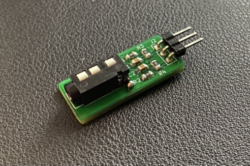

Shield: [![CC BY-NC-SA 4.0][cc-by-nc-sa-shield]][cc-by-nc-sa]

This work is licensed under a
[Creative Commons Attribution-NonCommercial-ShareAlike 4.0 International License][cc-by-nc-sa].

[![CC BY-NC-SA 4.0][cc-by-nc-sa-image]][cc-by-nc-sa]

[cc-by-nc-sa]: http://creativecommons.org/licenses/by-nc-sa/4.0/
[cc-by-nc-sa-image]: https://licensebuttons.net/l/by-nc-sa/4.0/88x31.png
[cc-by-nc-sa-shield]: https://img.shields.io/badge/License-CC%20BY--NC--SA%204.0-lightgrey.svg

## Donations / Spenden
If somebody wants to support me for upcoming projects :)  
- PayPal:  
- Amazon Giftcard: https://www.amazon.de/Amazon-Gutschein-per-E-Mail-Amazon/dp/B0054PDOV8 - stefan.riese@me.com

# WLED_AudioJackAdapter

## Features
- Connect 3.5mm audio jack to WLED controller input pin

## BOM
- J1: Audio Jack PJ320D - https://www.ebay.de/itm/393422313034
- J2: 3-pin header male
- C1, C2: 100nF 0805
- R1, R2: 680 Ohm 0805
- R3, R4: 1M Ohm 0805

## Wiring diagram
- https://github.com/Hasenpups/WLED_AudioJackAdapter_Public/blob/main/WLED_AudioJackAdapter.pdf

## References
- Sound reactive WLED: https://github.com/atuline/WLED/releases
- Wiring example: https://github.com/atuline/WLED/wiki/Analog-Audio-Input-Options
